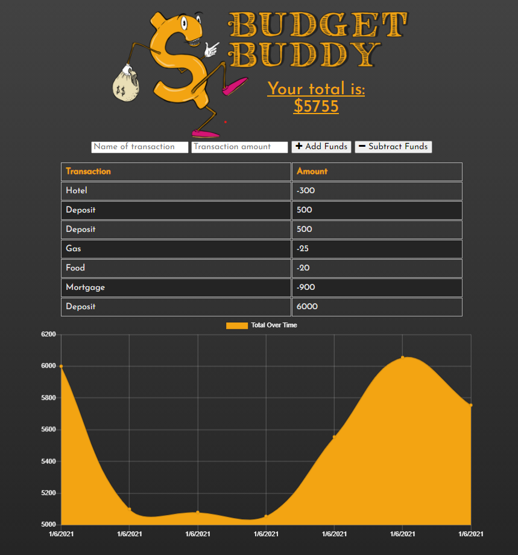

Budget Buddy is a small budget tracker application that allows for offline access and functionality!

## Table of Contents

* [Description](#description)
* [Usage](#usage)
* [Screenshots](#screenshots)
* [Questions](#questions)

## Description

* Link to the Heroku deployed application - [Budget Buddy](https://warm-taiga-26819.herokuapp.com/)
* Simple application powered by [Node.js](https://nodejs.org/en/), [Express](http://expressjs.com/) , [MongoDB](https://www.mongodb.com/) , [IndexedDB](https://developer.mozilla.org/en-US/docs/Web/API/IndexedDB_API)
* Built to allow off-line functionality
* I created the logo - more examples of my artwork `BERTO` (www.robertorubet.com)

## Usage

The site is fairly straightforward. Users are allowed to input transactions, which get logged in the `LEDGER` and added to the `CHART`. As an additional level of functionality, Budget Buddy will allow a user to work off-line. Any transactions that are entered, while off-line, will be stored `LOCALLY`. Once Budget Buddy detects that the user is back on-line, the stored transactions will be sent to the database and stored on a more permanent basis.

## Screenshots

Screenshot of the page

## Questions

Feel free to get in touch with me if you have any questions or concerns.

Link to my GitHub Profile: [Bertodemus](https://github.com/bertodemus)

Email me at: [roberto@robertorubet.com](roberto@robertorubet.com)

